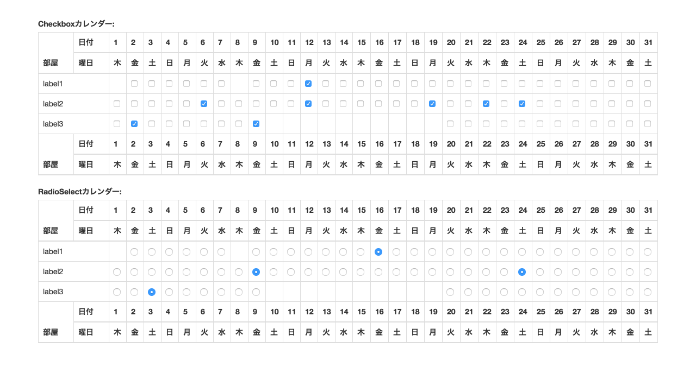

# django_calendar_field

Description:
------------
* 図のようなフォームでChoiceに対する日付を複数選択する



Requirements:
-------------
* Python 3.4 or later
* Django 1.8 or later

Install:
--------

```bash
pip install git+ssh://git@github.com:okwrtdsh/django_calendar_field.git
```

Usage:
------

```python
# forms.py
class SomeForm(forms.Form):
     calendar = CalendarMultipleChoiceField(
        label="field_label",
        choices=(
            ("value1", "label1"),
            ("value2", "label2"),
            ("value3", "label3"),
        )
    )

    def __init__(self, *args, **kwargs):
        super().__init__(*args, **kwargs)
        self.fields['calendar'].disables=(
            ("value1", [datetime.date.today()]),  # Disable today
            ("value3", [datetime.date.today().replace(day=1 + i) for i in range(10)])  # Disable 10 days from 1st day
        )
```

```Python
# cleaned_data
{'calendar': [
    ('value1', [datetime.date(2016, 1, 1), datetime.date(2016, 1, 2)]),
    ('value2', [datetime.date(2016, 1, 1), datetime.date(2016, 1, 2), datetime.date(2016, 9, 3)])
]}
```